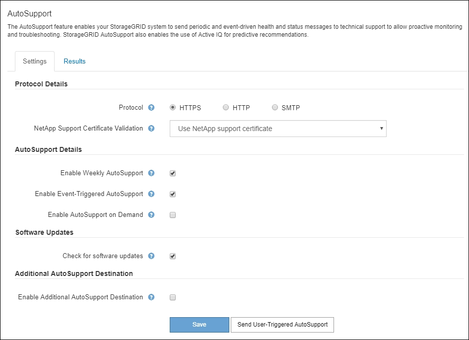

= Configure AutoSupport
:allow-uri-read: 
:icons: font
:imagesdir: ../media/

[role="lead"]
Puede habilitar la función AutoSupport y las opciones individuales de AutoSupport cuando instale StorageGRID por primera vez, o bien puede habilitarlas más adelante.

.Antes de empezar
* Ha iniciado sesión en Grid Manager mediante un link:../admin/web-browser-requirements.html["navegador web compatible"].
* Tiene el permiso acceso raíz u otra configuración de cuadrícula.
* Si va a utilizar HTTPS para enviar mensajes de AutoSupport, ha proporcionado acceso a Internet saliente al nodo de administración principal, ya sea directamente o link:configuring-admin-proxy-settings.html["utilizando un servidor proxy"] (no se requieren conexiones entrantes).
* Si se selecciona HTTP en la página StorageGRID AutoSupport, se ha configurado un servidor proxy para reenviar mensajes de AutoSupport como HTTPS. Los servidores AutoSupport de NetApp rechazarán los mensajes enviados mediante HTTP.
+
link:configuring-admin-proxy-settings.html["Obtenga más información sobre la configuración de los ajustes de proxy de administración"].

* Si utilizará SMTP como protocolo para mensajes de AutoSupport, configuró un servidor de correo SMTP. La misma configuración del servidor de correo se utiliza para las notificaciones de correo electrónico de alarma (sistema heredado).

== Especifique el protocolo para los mensajes de AutoSupport

Puede utilizar cualquiera de los siguientes protocolos para enviar mensajes de AutoSupport:

* *HTTPS*: Es la configuración predeterminada y recomendada para nuevas instalaciones. Este protocolo utiliza el puerto 443. Si desea <<Habilite AutoSupport bajo demanda,Habilite la función AutoSupport On Demand>>, Debe utilizar HTTPS.
* *HTTP*: Si selecciona HTTP, debe configurar un servidor proxy para reenviar mensajes AutoSupport como HTTPS. Los servidores AutoSupport de NetApp rechazan los mensajes enviados mediante HTTP. Este protocolo utiliza el puerto 80.
* *SMTP*: Utilice esta opción si desea que se envíen mensajes de AutoSupport por correo electrónico. Si utiliza SMTP como protocolo para mensajes AutoSupport, debe configurar un servidor de correo SMTP en la página Configuración de correo electrónico heredado (*SUPPORT* > *Alarmas (heredado)* > *Configuración de correo electrónico heredado*).
+

NOTE: SMTP era el único protocolo disponible para mensajes de AutoSupport antes de la versión de StorageGRID 11.2. Si instaló inicialmente una versión anterior de StorageGRID, es posible que SMTP sea el protocolo seleccionado.

El protocolo configurado se utiliza para enviar todos los tipos de mensajes de AutoSupport.

.Pasos
. Seleccione *SUPPORT* > *Tools* > *AutoSupport*.
+
Aparece la página AutoSupport y la ficha *Configuración* está seleccionada.

+

. Seleccione el protocolo que desea utilizar para enviar mensajes de AutoSupport.
. Si seleccionó *HTTPS*, seleccione si desea utilizar un certificado TLS para proteger la conexión con el servidor de soporte de NetApp.
+
** *Utilizar el certificado de soporte de NetApp* (predeterminado): La validación del certificado garantiza la seguridad de la transmisión de mensajes AutoSupport. El certificado de soporte de NetApp ya está instalado con el software StorageGRID.
** *No verificar certificado*: Seleccione esta opción sólo cuando tenga un buen motivo para no utilizar la validación de certificados, como cuando haya un problema temporal con un certificado.

. Seleccione *Guardar*.
+
Todos los mensajes semanales, activados por el usuario y activados por un evento se envían mediante el protocolo seleccionado.

== Desactivar los mensajes semanales de AutoSupport

De manera predeterminada, el sistema StorageGRID se configura para que envíe un mensaje de AutoSupport al soporte de NetApp una vez por semana.

Para determinar cuándo se enviará el mensaje semanal de AutoSupport, vaya a la ficha *AutoSupport* > *resultados*. En la sección *AutoSupport* semanal, consulte el valor de *próxima hora programada*.

image::../media/autosupport_weekly_next_scheduled_time.png[Hora programada siguiente para el AutoSupport semanal]

Puede deshabilitar el envío automático de mensajes semanales de AutoSupport en cualquier momento.

.Pasos
. Seleccione *SUPPORT* > *Tools* > *AutoSupport*.
. Desactive la casilla de verificación *Activar AutoSupport semanal*.
. Seleccione *Guardar*.

== Deshabilite los mensajes de AutoSupport activados por un evento

De forma predeterminada, el sistema StorageGRID se configura para enviar un mensaje de AutoSupport al soporte de NetApp cuando se produce una alerta importante u otro evento significativo del sistema.

Puede deshabilitar los mensajes de AutoSupport activados por eventos en cualquier momento.

.Pasos
. Seleccione *SUPPORT* > *Tools* > *AutoSupport*.
. Desactive la casilla de verificación *Activar AutoSupport desencadenado por eventos*.
. Seleccione *Guardar*.

== Habilite AutoSupport bajo demanda

AutoSupport On Demand puede ayudar a resolver problemas en los que el soporte técnico está trabajando activamente.

De manera predeterminada, AutoSupport On Demand está deshabilitado. Al habilitar esta función, el soporte técnico puede solicitar que el sistema StorageGRID envíe mensajes de AutoSupport automáticamente. El soporte técnico también puede establecer el intervalo de sondeo para AutoSupport en consultas bajo demanda.

El soporte técnico no puede habilitar ni deshabilitar AutoSupport On Demand.

.Pasos
. Seleccione *SUPPORT* > *Tools* > *AutoSupport*.
. Seleccione *HTTPS* para el protocolo.
. Seleccione la casilla de verificación *Activar AutoSupport semanal*.
. Seleccione la casilla de verificación *Activar AutoSupport On Demand*.
. Seleccione *Guardar*.
+
AutoSupport On Demand está habilitado y el soporte técnico puede enviar solicitudes AutoSupport On Demand a StorageGRID.

== Desactive las comprobaciones de actualizaciones de software

De forma predeterminada, StorageGRID se pone en contacto con NetApp para determinar si hay actualizaciones de software disponibles para su sistema. Si hay disponible una revisión o versión nueva de StorageGRID, se muestra la nueva versión en la página actualización de StorageGRID.

Según sea necesario, puede desactivar opcionalmente la comprobación de actualizaciones de software. Por ejemplo, si el sistema no tiene acceso WAN, debe desactivar la comprobación para evitar errores de descarga.

.Pasos
. Seleccione *SUPPORT* > *Tools* > *AutoSupport*.
. Desactive la casilla de verificación *Comprobar si hay actualizaciones de software*.
. Seleccione *Guardar*.

== Añada un destino de AutoSupport adicional

Cuando habilita AutoSupport, se envían mensajes de estado y estado al soporte de NetApp. Puede especificar un destino adicional para todos los mensajes de AutoSupport.

Para comprobar o cambiar el protocolo utilizado para enviar mensajes AutoSupport, consulte las instrucciones a. <<Especifique el protocolo para los mensajes de AutoSupport>>.

NOTE: No puede usar el protocolo SMTP para enviar mensajes de AutoSupport a un destino adicional.

.Pasos
. Seleccione *SUPPORT* > *Tools* > *AutoSupport*.
. Selecciona *Activar destino AutoSupport adicional*.
. Especifique lo siguiente:
+
[cols="1a,2a"]
|===
| Campo | Descripción 

 a| 
Nombre del hostl
 a| 
Nombre de host o dirección IP del servidor de un servidor de destino AutoSupport adicional.

*Nota*: Puedes ingresar solo un destino adicional.

 a| 
Puerto
 a| 
Puerto utilizado para conectarse a un servidor de destino AutoSupport adicional. El valor predeterminado es el puerto 80 para HTTP o el puerto 443 para HTTPS.

 a| 
Validación de certificación
 a| 
Si se utiliza un certificado TLS para proteger la conexión al destino adicional.

** Seleccione *No verificar certificado* para enviar sus mensajes AutoSupport sin validación de certificado.
+
Seleccione esta opción sólo cuando tenga un buen motivo para no utilizar la validación de certificados, como cuando haya un problema temporal con un certificado.

** Seleccione *Usar paquete de CA personalizado* para utilizar la validación de certificados.

|===
. Si seleccionó *Usar paquete de CA personalizado*, realice una de las siguientes acciones:
+
** Seleccione *examinar*, desplácese hasta el archivo que contiene los certificados y, a continuación, seleccione *Abrir* para cargar el archivo.
** Utilice una herramienta de edición para copiar y pegar todo el contenido de cada uno de los archivos de certificado CA codificados con PEM en el campo *CA Bundle*, concatenado en orden de cadena de certificados.
+
Debe incluir `----BEGIN CERTIFICATE----` y.. `----END CERTIFICATE----` en su selección.

+
image::../media/autosupport_certificate.png[Certificado AutoSupport]

. Seleccione *Guardar*.
+
Todos los futuros mensajes de AutoSupport semanales, activados por un evento y activados por el usuario se enviarán al destino adicional.

