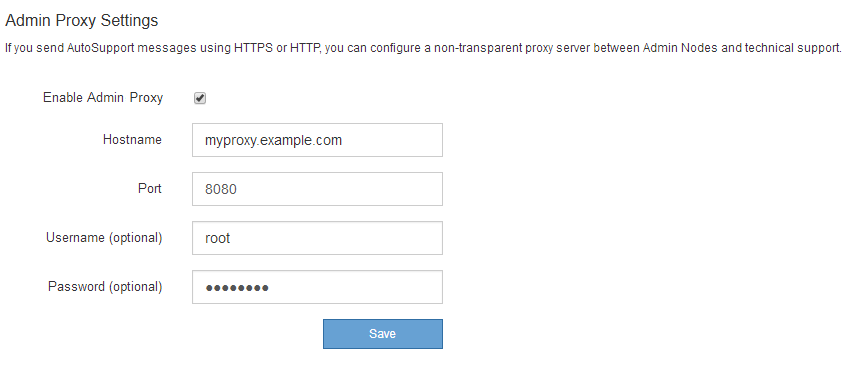

= Configure los ajustes del proxy de administración
:allow-uri-read: 
:icons: font
:imagesdir: ../media/

[role="lead"]
Si envía mensajes de AutoSupport con HTTP o HTTPS (consulte link:configure-autosupport-grid-manager.html["Configure AutoSupport"]), puede configurar un servidor proxy no transparente entre los nodos de administración y el soporte técnico (AutoSupport).

.Antes de empezar
* Tiene permisos de acceso específicos.
* Ha iniciado sesión en Grid Manager mediante un link:../admin/web-browser-requirements.html["navegador web compatible"].

.Acerca de esta tarea
Puede configurar los ajustes de un único proxy de administración.

.Pasos
. Seleccione *CONFIGURACIÓN* > *Seguridad* > *Ajustes de proxy*.
+
Aparece la página Admin Proxy Settings (Configuración del proxy de administración). De forma predeterminada, *almacenamiento* está seleccionado en el menú de la barra lateral.

. En el menú de la barra lateral, seleccione *Admin*.
+
image::../media/proxy_settings_menu_admin.png[Menú de configuración de proxy: Administración]

. Seleccione la casilla de verificación *Enable Admin Proxy*.
+

. Introduzca el nombre de host o la dirección IP del servidor proxy.
. Introduzca el puerto utilizado para conectarse al servidor proxy.
. Si lo desea, introduzca el nombre de usuario del proxy.
+
Deje este campo en blanco si el servidor proxy no requiere un nombre de usuario.

. De forma opcional, introduzca la contraseña del proxy.
+
Deje este campo en blanco si el servidor proxy no requiere una contraseña.

. Seleccione *Guardar*.
+
Una vez guardado el proxy de administrador, se configura el servidor proxy entre los nodos de administrador y el soporte técnico.

+

NOTE: Los cambios de proxy pueden tardar hasta 10 minutos en surtir efecto.

. Si necesita deshabilitar el proxy, desactive la casilla de verificación *Habilitar proxy de administración* y seleccione *Guardar*.

