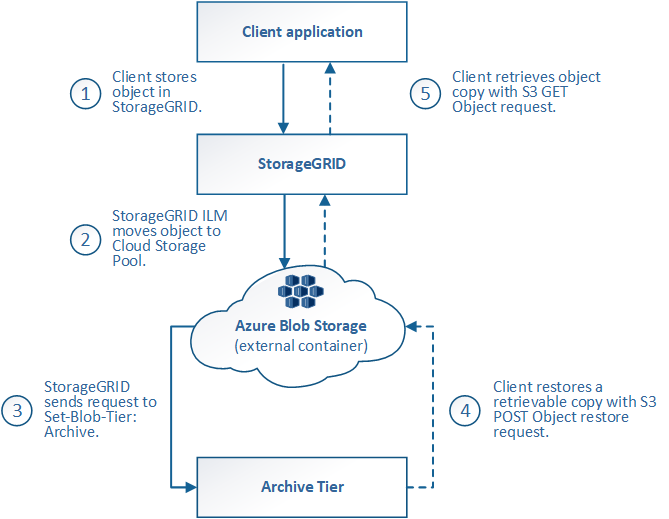

= Ciclo de vida de un objeto de Cloud Storage Pool
:allow-uri-read: 
:icons: font
:imagesdir: ../media/

[role="lead"]
Antes de implementar Cloud Storage Pools, revise el ciclo de vida de los objetos que se almacenan en cada tipo de pool de almacenamiento en cloud.

* <<S3: Ciclo de vida de un objeto de Cloud Storage Pool>>
* <<Azure: Ciclo de vida de un objeto de Cloud Storage Pool>>

== S3: Ciclo de vida de un objeto de Cloud Storage Pool

En la figura, se muestran las etapas del ciclo de vida de un objeto almacenado en un pool de almacenamiento en cloud de S3.

NOTE: En la figura y las explicaciones, "'Glacier'" hace referencia tanto a la clase de almacenamiento Glacier como a la clase de almacenamiento Glacier Deep Archive, con una excepción: La clase de almacenamiento Glacier Deep Archive no admite el nivel de restauración acelerada. Solo se admite la recuperación masiva o estándar.

NOTE: Google Cloud Platform (GCP) admite la recuperación de objetos de un almacenamiento a largo plazo sin necesidad de una operación POSTERIOR a la restauración.

image::../media/cloud_storage_pool_object_life_cycle.png[Ciclo de vida de un objeto de pool de almacenamiento en cloud]

. *Objeto almacenado en StorageGRID*
+
Para iniciar el ciclo de vida, una aplicación cliente almacena un objeto en StorageGRID.

. *Objeto movido a S3 Cloud Storage Pool*
+
** Cuando el objeto coincide con una regla de ILM que utiliza un S3 Cloud Storage Pool como ubicación, StorageGRID mueve el objeto al bloque de S3 externo especificado por el Cloud Storage Pool.
** Cuando el objeto se haya movido a S3 Cloud Storage Pool, la aplicación cliente puede recuperarlo con una solicitud DE OBJETO GET de S3 de StorageGRID, a menos que el objeto se haya migrado al almacenamiento Glacier.

. *Objeto que ha pasado a Glacier (estado no recuperable)*
+
** Opcionalmente, se puede cambiar el objeto al almacenamiento Glacier. Por ejemplo, el bloque externo de S3 puede utilizar la configuración del ciclo de vida para mover un objeto al almacenamiento Glacier de inmediato o después de varios días.
+

NOTE: Si desea realizar la transición de objetos, debe crear una configuración de ciclo de vida para el bloque de S3 externo y debe usar una solución de almacenamiento que implemente la clase de almacenamiento Glacier y sea compatible con la API DE restauración DE objetos S3 POSTERIOR.

+

NOTE: No utilice Cloud Storage Pools para objetos que han ingerido los clientes Swift. Swift no admite solicitudes DE restauración POSTERIOR de objetos, por lo que StorageGRID no podrá recuperar objetos Swift que se hayan migrado al almacenamiento S3 Glacier. La emisión de una solicitud de objeto GET de Swift para recuperar estos objetos fallará (403 Prohibido).

** Durante la transición, la aplicación cliente puede usar una solicitud DE objeto HEAD de S3 para supervisar el estado del objeto.

. *Objeto restaurado desde el almacenamiento Glacier*
+
Si se ha realizado la transición de un objeto al almacenamiento Glacier, la aplicación cliente puede emitir una solicitud DE restauración DE objetos S3 POSTERIOR para restaurar una copia recuperable al pool de almacenamiento en cloud de S3. La solicitud especifica cuántos días debe estar disponible la copia en el Cloud Storage Pool y en el nivel de acceso a datos que se usará en la operación de restauración (acelerada, estándar o masiva). Cuando se alcanza la fecha de vencimiento de la copia recuperable, la copia se devuelve automáticamente a un estado no recuperable.

+

NOTE: Si también hay una o varias copias del objeto en los nodos de almacenamiento de StorageGRID, no es necesario restaurar el objeto desde Glacier con una solicitud DE restauración POSTERIOR a objeto. En su lugar, la copia local se puede recuperar directamente, utilizando UNA solicitud GET Object.

. *Objeto recuperado*
+
Una vez restaurado un objeto, la aplicación cliente puede emitir UNA solicitud GET Object para recuperar el objeto restaurado.

== Azure: Ciclo de vida de un objeto de Cloud Storage Pool

En la figura, se muestran las etapas del ciclo de vida de un objeto almacenado en un pool de almacenamiento en cloud de Azure.

. *Objeto almacenado en StorageGRID*
+
Para iniciar el ciclo de vida, una aplicación cliente almacena un objeto en StorageGRID.

. *Objeto movido a Azure Cloud Storage Pool*
+
Cuando el objeto coincide con una regla de ILM que utiliza un Azure Cloud Storage Pool como ubicación de ubicación, StorageGRID mueve el objeto al contenedor de almacenamiento externo de Azure Blob especificado por el Cloud Storage Pool

+

NOTE: No utilice Cloud Storage Pools para objetos que han ingerido los clientes Swift. Swift no admite solicitudes POSTERIORES a la restauración de objetos, por lo que StorageGRID no podrá recuperar objetos de Swift que se hayan migrado al nivel de archivado de almacenamiento de Azure Blob. La emisión de una solicitud de objeto GET de Swift para recuperar estos objetos fallará (403 Prohibido).

. *Objeto que ha pasado a la capa de archivado (estado no recuperable)*
+
Inmediatamente después de mover el objeto a Azure Cloud Storage Pool, StorageGRID realiza una transición automática del objeto al nivel de archivado de almacenamiento de Azure Blob.

. *Objeto restaurado desde el nivel de archivo*
+
Si se ha realizado la transición de un objeto al nivel de archivado, la aplicación cliente puede emitir una solicitud DE restauración DE objetos S3 POSTERIOR para restaurar una copia recuperable a Azure Cloud Storage Pool.

+
Cuando StorageGRID recibe LA restauración DE objetos POSTERIOR, este realiza una transición temporal del objeto al nivel de refrigeración del almacenamiento de Azure Blob. Tan pronto como se alcanza la fecha de vencimiento de la solicitud DE restauración DE objeto POSTERIOR, StorageGRID realiza la transición del objeto de nuevo al nivel de archivado.

+

NOTE: Si también existen una o varias copias del objeto en los nodos de almacenamiento dentro de StorageGRID, no es necesario restaurar el objeto desde el nivel de acceso de archivado mediante la emisión de una solicitud DE restauración DE objetos POSTERIOR. En su lugar, la copia local se puede recuperar directamente, utilizando UNA solicitud GET Object.

. *Objeto recuperado*
+
Una vez que se ha restaurado un objeto en Azure Cloud Storage Pool, la aplicación cliente puede emitir una solicitud GET Object para recuperar el objeto restaurado.

.Información relacionada
link:../s3/index.html["USE LA API DE REST DE S3"]
