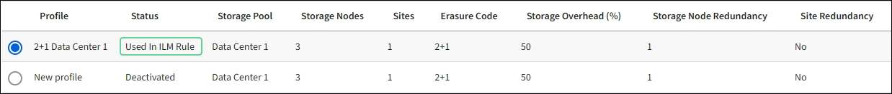

= Gestione los perfiles de código de borrado
:allow-uri-read: 
:icons: font
:imagesdir: ../media/

[role="lead"]
Si es necesario, puede cambiar el nombre de un perfil de código de borrado. Es posible desactivar un perfil de código de borrado si actualmente no se está utilizando en ninguna regla de ILM.

== Cambie el nombre de un perfil de código de borrado

Es posible que desee cambiar el nombre de un perfil de codificación de borrado para que sea más obvio lo que hace el perfil.

.Antes de empezar
* Ha iniciado sesión en Grid Manager mediante un link:../admin/web-browser-requirements.html["navegador web compatible"].
* Usted tiene la link:../admin/admin-group-permissions.html["permisos de acceso requeridos"].

.Pasos
. Seleccione *ILM* > *codificación de borrado*.
. Seleccione el perfil al que desea cambiar el nombre.
. Seleccione *Cambiar nombre*.
. Introduzca un nombre único para el perfil de código de borrado.
+
El nombre del perfil de codificación de borrado se añade al nombre del pool de almacenamiento en la instrucción de ubicación para una regla de ILM.

+

NOTE: Los nombres de perfil de código de borrado deben ser únicos. Se produce un error de validación si utiliza el nombre de un perfil existente, incluso si dicho perfil se ha desactivado.

. Seleccione *Guardar*.

== Desactivar un perfil de código de borrado

Puede desactivar un perfil de código de borrado si ya no tiene pensado utilizarlo y si el perfil no se está utilizando en ninguna regla de ILM.

.Antes de empezar
* Ha iniciado sesión en Grid Manager mediante un link:../admin/web-browser-requirements.html["navegador web compatible"].
* Usted tiene la link:../admin/admin-group-permissions.html["permisos de acceso requeridos"].
* Ha confirmado que no hay operaciones de reparación de datos codificados para borrado ni procedimientos de retirada en curso. Se devuelve un mensaje de error si intenta desactivar un perfil de código de borrado mientras se realiza alguna de estas operaciones.

.Acerca de esta tarea
Al desactivar un perfil de codificación de borrado, el perfil sigue apareciendo en la página Perfiles de codificación de borrado, pero su estado es *Desactivado*.

image::../media/deactivated_ec_profile.png[Perfil EC desactivado]

Ya no puede utilizar un perfil de código de borrado desactivado. No se muestra un perfil desactivado al crear las instrucciones de colocación para una regla de ILM. No puede reactivar un perfil desactivado.

StorageGRID evita que desactive un perfil de código de borrado si se cumple alguna de las siguientes condiciones:

* El perfil de código de borrado se utiliza actualmente en una regla de ILM.
* El perfil de código de borrado ya no se usa en ninguna regla de ILM, pero los datos de los objetos y los fragmentos de paridad del perfil siguen existiendo.

.Pasos
. Seleccione *ILM* > *código de borrado*.
. Revise la columna *Status* para confirmar que el perfil de codificación de borrado que desea desactivar no se utiliza en ninguna regla de ILM.
+
No es posible desactivar un perfil de código de borrado si se utiliza en alguna regla de ILM. En el ejemplo, el perfil del Centro de datos *2+1 1* se utiliza en al menos una regla de ILM.

+

. Si el perfil se utiliza en una regla de ILM, siga estos pasos:
+
.. Seleccione *ILM* > *Reglas*.
.. Seleccione cada regla y revise el diagrama de retención para determinar si la regla utiliza el perfil de código de borrado que desea desactivar.
.. Si la regla de ILM utiliza el perfil de código de borrado que desea desactivar, determine si la regla se utiliza en la política de ILM activa o en una política propuesta.
.. Complete los pasos adicionales de la tabla, según el lugar en el que se utilice el perfil de código de borrado.
+
[cols="2a,4a,1a"]
|===
| ¿Dónde se ha utilizado el perfil? | Pasos adicionales que se deben realizar antes de desactivar el perfil | Consulte estas instrucciones adicionales 

 a| 
No se usa nunca en ninguna regla de ILM
 a| 
No se requieren pasos adicionales. Continúe con este procedimiento.
 a| 
_Ninguno_

 a| 
En una regla de ILM que nunca se haya usado en ninguna política de ILM
 a| 
... Edite o elimine todas las reglas de ILM afectadas. Si edita la regla, elimine todas las ubicaciones que utilicen el perfil de código de borrado.
... Continúe con este procedimiento.

 a| 
link:working-with-ilm-rules-and-ilm-policies.html["Trabaje con las reglas de ILM y las políticas de ILM"]

 a| 
En una regla de ILM que esté actualmente en la política activa de ILM
 a| 
... Clonar la política activa.
... Quite la regla de ILM que utilice el perfil de código de borrado.
... Añada una o varias reglas nuevas de ILM para garantizar la protección de los objetos.
... Guarde, simule y active la nueva directiva.
... Espere a que se aplique la nueva directiva y a que los objetos existentes se muevan a nuevas ubicaciones en función de las nuevas reglas que haya agregado.
+
*Nota:* dependiendo del número de objetos y del tamaño de su sistema StorageGRID, las operaciones de ILM pueden tardar semanas o incluso meses en mover los objetos a nuevas ubicaciones, según las nuevas reglas de ILM.

+
Aunque puede intentar desactivar de forma segura un perfil de codificación de borrado mientras aún está asociado a los datos, la operación de desactivación fallará. Un mensaje de error le informará si el perfil aún no está listo para ser desactivado.

... Edite o elimine la regla que ha eliminado de la política. Si edita la regla, elimine todas las ubicaciones que utilicen el perfil de código de borrado.
... Continúe con este procedimiento.

 a| 
link:creating-ilm-policy.html["Cree una política de ILM"]

link:working-with-ilm-rules-and-ilm-policies.html["Trabaje con las reglas de ILM y las políticas de ILM"]

 a| 
En una regla de ILM que se encuentra actualmente en una política de ILM propuesta
 a| 
... Edite la directiva propuesta.
... Quite la regla de ILM que utilice el perfil de código de borrado.
... Añada una o varias reglas nuevas de ILM para garantizar que todos los objetos estén protegidos.
... Guarde la directiva propuesta.
... Edite o elimine la regla que ha eliminado de la política. Si edita la regla, elimine todas las ubicaciones que utilicen el perfil de código de borrado.
... Continúe con este procedimiento.

 a| 
link:creating-ilm-policy.html["Cree una política de ILM"]

link:working-with-ilm-rules-and-ilm-policies.html["Trabaje con las reglas de ILM y las políticas de ILM"]

 a| 
En una regla de ILM que está en una política histórica de ILM
 a| 
... Edite o elimine la regla. Si edita la regla, elimine todas las ubicaciones que utilicen el perfil de código de borrado. (La regla aparecerá ahora como una regla histórica en la política histórica.)
... Continúe con este procedimiento.

 a| 
link:working-with-ilm-rules-and-ilm-policies.html["Trabaje con las reglas de ILM y las políticas de ILM"]

|===
.. Actualice la página Perfiles de código de borrado para asegurarse de que el perfil no se utilice en una regla de ILM.

. Si el perfil no se utiliza en una regla de ILM, seleccione el botón de opción y seleccione *Desactivar*.
+
Aparece el cuadro de diálogo Desactivar perfil de EC.

. Si está seguro de que desea desactivar el perfil, seleccione *Desactivar*.
+
** Si StorageGRID puede desactivar el perfil de codificación de borrado, su estado es *desactivado*. Ya no puede seleccionar este perfil para ninguna regla de ILM.
** Si StorageGRID no puede desactivar el perfil, aparecerá un mensaje de error. Por ejemplo, aparece un mensaje de error si los datos del objeto siguen asociados a este perfil. Es posible que deba esperar varias semanas antes de volver a intentar el proceso de desactivación.

