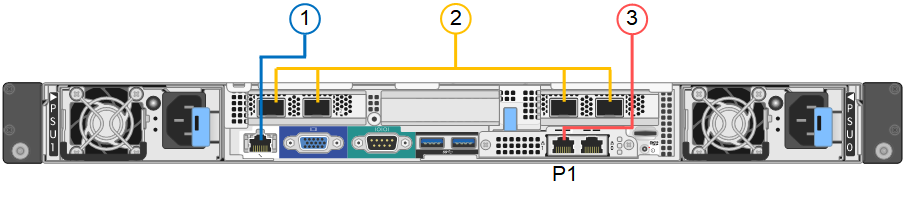

= Cable (SG100 y SG1000)
:allow-uri-read: 
:icons: font
:imagesdir: ../media/

[role="lead"]
Debe conectar el puerto de administración del dispositivo al ordenador portátil de servicio y conectar los puertos de red del dispositivo a la red de grid y a la red de cliente opcional para StorageGRID.

.Antes de empezar
* Tiene un cable Ethernet RJ-45 para conectar el puerto de administración.
* Tiene una de las siguientes opciones para los puertos de red. Estos elementos no se suministran con el aparato.
+
** De uno a cuatro cables Twinax para conectar los cuatro puertos de red.
** Para SG100, de uno a cuatro transceptores SFP+ o SFP28 si planea utilizar cables ópticos para los puertos.
** Para SG1000, de uno a cuatro transceptores QSFP+ o QSFP28 si va a utilizar cables ópticos para los puertos.

CAUTION: *Riesgo de exposición a la radiación láser* -- No desmonte ni retire ninguna parte de un transceptor SFP o QSFP. Puede que esté expuesto a la radiación láser.

.Acerca de esta tarea
Las siguientes figuras muestran los puertos de la parte posterior del aparato.

Conexiones de puerto SG100:

Conexiones de puerto SG1000:

image::../media/sg1000_connections.png[Conexiones de puerto SG1000]

[cols="1a,2a,2a,3a"]
|===
| Llamada | Puerto | Tipo de puerto | Uso 

 a| 
1
 a| 
Puerto de gestión BMC en el dispositivo
 a| 
1 GbE (RJ-45).
 a| 
Se conecta a la red en la que se accede a la interfaz del BMC.

 a| 
2
 a| 
Cuatro puertos de red en el dispositivo
 a| 
* Para el SG100: 10/25-GbE
* Para el SG1000: 10/25/40/100-GbE

 a| 
Conéctese a la red de red y a la red de cliente para StorageGRID.

 a| 
3
 a| 
Puerto de red de administración en el dispositivo (con la etiqueta P1 en las figuras)
 a| 
1 GbE (RJ-45).

*Importante:* este puerto funciona sólo a 1000 BaseT/full y no admite velocidades de 10 o 100 megabits.
 a| 
Conecta el dispositivo a la red de administración para StorageGRID.

 a| 
 a| 
El puerto RJ-45 más a la derecha del aparato
 a| 
1 GbE (RJ-45).

*Importante:* este puerto funciona sólo a 1000 BaseT/full y no admite velocidades de 10 o 100 megabits.
 a| 
* Se puede unir al puerto de administración 1 si desea una conexión redundante a la red de administración.
* Se puede dejar desconectado y disponible para acceso local temporal (IP 169.254.0.1).
* Durante la instalación, se puede usar para conectar el dispositivo a un portátil de servicio si las direcciones IP asignadas por DHCP no están disponibles.

|===
.Pasos
. Conecte el puerto de gestión BMC del dispositivo a la red de gestión mediante un cable Ethernet.
+
Aunque esta conexión es opcional, se recomienda facilitar el soporte.

. Conecte los puertos de red del dispositivo a los switches de red adecuados utilizando cables Twinax o cables ópticos y transceptores.
+
[NOTE]
====
Los cuatro puertos de red deben utilizar la misma velocidad de enlace. Consulte la siguiente tabla para conocer el equipo necesario para su hardware y velocidad de enlace.

[cols="2a,2a"]
|===
| Velocidad de enlace SG100 (GbE) | Equipo necesario 

 a| 
10
 a| 
Transceptor SFP+

 a| 
25
 a| 
Transceptor SFP28

| Velocidad de enlace SG1000 (GbE) | Equipo necesario 

 a| 
10
 a| 
Transceptor QSA y SFP+

 a| 
25
 a| 
Transceptor QSA y SFP28

 a| 
40
 a| 
Transceptor QSFP+

 a| 
100
 a| 
Transceptor QFSP28

|===
====
+
** Si piensa utilizar el modo de enlace de puerto fijo (predeterminado), conecte los puertos a la red de StorageGRID y a las redes de cliente, como se muestra en la tabla.
+
[cols="1a,2a"]
|===
| Puerto | Conecta a... 

 a| 
Puerto 1
 a| 
Red de cliente (opcional)

 a| 
Puerto 2
 a| 
Red Grid

 a| 
Puerto 3
 a| 
Red de cliente (opcional)

 a| 
Puerto 4
 a| 
Red Grid

|===
** Si planea utilizar el modo de enlace de puerto agregado, conecte uno o varios puertos de red a uno o varios switches. Debe conectar al menos dos de los cuatro puertos para evitar tener un único punto de error. Si utiliza más de un switch para un único vínculo LACP, los switches deben ser compatibles con MLAG o equivalente.

. Si tiene previsto utilizar la Red de administración para StorageGRID, conecte el puerto Red de administración del dispositivo a la Red de administración mediante un cable Ethernet.

