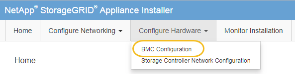

= Cambie la contraseña raíz de la interfaz de BMC
:allow-uri-read: 
:icons: font
:imagesdir: ../media/

[role="lead"]
Por motivos de seguridad, debe cambiar la contraseña del usuario raíz del BMC.

.Antes de empezar
El cliente de gestión está usando un link:../admin/web-browser-requirements.html["navegador web compatible"].

.Acerca de esta tarea
La primera vez que instala el dispositivo, BMC utiliza una contraseña predeterminada para el usuario root. Debe cambiar la contraseña del usuario raíz para proteger el sistema.

.Pasos
. Desde el cliente, introduzca la URL del instalador de dispositivos de StorageGRID: +
`*https://_Appliance_IP_:8443*`
+
Para `_Appliance_IP_`, Utilice la dirección IP del dispositivo en cualquier red StorageGRID.

+
Aparece la página de inicio del instalador de dispositivos de StorageGRID.

. Seleccione *Configurar hardware* > *Configuración BMC*.
+

+
Aparece la página Configuración de la controladora de gestión de placa base.

. Introduzca una nueva contraseña para la cuenta raíz en los dos campos proporcionados.
+
image::../media/bmc_root_password.gif[Contraseña raíz de BMC]

. Haga clic en *Guardar*.

