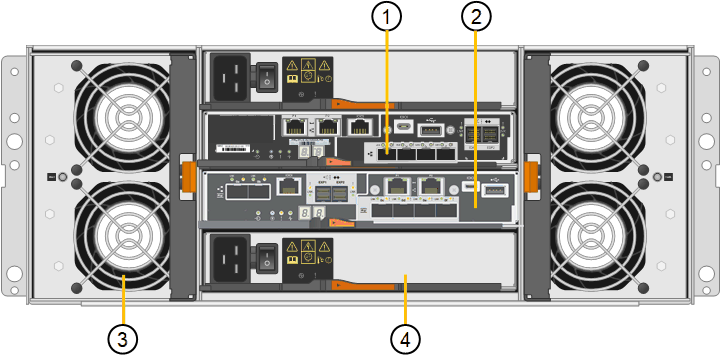

= Dispositivo SG5700: Información general
:allow-uri-read: 
:icons: font
:imagesdir: ../media/

[role="lead"]
El dispositivo SG5700 StorageGRID es una plataforma informática y de almacenamiento integrada que funciona como nodo de almacenamiento en un grid StorageGRID. El dispositivo se puede utilizar en un entorno de grid híbrido que combina los nodos de almacenamiento del dispositivo y los nodos de almacenamiento virtuales (basados en software).

El dispositivo de la serie SG5700 de StorageGRID proporciona las siguientes funciones:

* Integre los elementos de computación y almacenamiento para un nodo de almacenamiento de StorageGRID.
* Incluya el instalador de dispositivos StorageGRID para simplificar la puesta en marcha y la configuración del nodo de almacenamiento.
* Incluye System Manager de la serie E-Series SANtricity para la gestión y supervisión del hardware.
* Admite hasta cuatro conexiones de 10 GbE o 25 GbE a la red Grid y a la red cliente de StorageGRID.
* Compatible con unidades de cifrado de disco completo (FDE) o FIPS. Cuando estas unidades se usan con la función Drive Security en SANtricity System Manager, se evita el acceso no autorizado a los datos.

El dispositivo SG5700 está disponible en cuatro modelos: SG5712 y SG5712X, así como SG5760 y SG5760X. No existen diferencias de especificación o funcionamiento entre el SG5712 y el SG5712X, excepto la ubicación de los puertos de interconexión de la controladora de almacenamiento. Del mismo modo, no hay especificaciones o diferencias funcionales entre el SG5760 y el SG5760X excepto en lo que respecta a la ubicación de los puertos de interconexión en la controladora de almacenamiento.

== SG5700 componentes

Los modelos SG5700 incluyen los siguientes componentes:

[cols="1a,1a,1a,1a,1a"]
|===
| Componente | SG5712 | SG5712X | SG5760 | SG5760X 

 a| 
Controladora de computación
 a| 
Controladora E5700SG
 a| 
Controladora E5700SG
 a| 
Controladora E5700SG
 a| 
Controladora E5700SG

 a| 
Controladora de almacenamiento
 a| 
Controladora E2800A
 a| 
Controladora E2800B
 a| 
Controladora E2800A
 a| 
Controladora E2800B

 a| 
Chasis
 a| 
E-Series DE212C, un compartimento de dos unidades rack (2U)
 a| 
E-Series DE212C, un compartimento de dos unidades rack (2U)
 a| 
Compartimento DE460C E-Series, un compartimento de cuatro unidades de rack (4U)
 a| 
Compartimento DE460C E-Series, un compartimento de cuatro unidades de rack (4U)

 a| 
Unidades
 a| 
12 unidades NL-SAS (3.5 pulgadas)
 a| 
12 unidades NL-SAS (3.5 pulgadas)
 a| 
60 unidades NL-SAS (3.5 pulgadas)
 a| 
60 unidades NL-SAS (3.5 pulgadas)

 a| 
Sistemas de alimentación y ventiladores redundantes
 a| 
Dos contenedores de alimentación/ventilador
 a| 
Dos contenedores de alimentación/ventilador
 a| 
Dos contenedores de alimentación y dos contenedores de ventilador
 a| 
Dos contenedores de alimentación y dos contenedores de ventilador

|===
El almacenamiento bruto máximo disponible en el dispositivo StorageGRID es fijo, en función del número de unidades de cada compartimento. No es posible ampliar el almacenamiento disponible añadiendo una bandeja con unidades adicionales.

== SG5700 diagramas

=== Vistas frontal y trasera de SG5712

Las cifras muestran la parte frontal y posterior del SG5712, un compartimento 2U con capacidad para 12 unidades.

image::../media/sg5712_front_and_back_views.gif[La parte frontal y posterior del dispositivo SG5712]

=== SG5712 componentes

El SG5712 incluye dos controladoras y dos contenedores de alimentación/ventilador.

image::../media/sg5712_with_callouts.gif[Controladoras y contenedores de alimentación/ventilador en el dispositivo SG5712]

[cols="1a,3a"]
|===
| Llamada | Descripción 

 a| 
1
 a| 
Controladora E2800A (controladora de almacenamiento)

 a| 
2
 a| 
Controladora E5700SG (controladora de computación)

 a| 
3
 a| 
Contenedores de alimentación/ventilador

|===

=== Vistas frontal y trasera de SG5712X

Las cifras muestran la parte frontal y posterior del SG5712X, un compartimento 2U con capacidad para 12 unidades.

image::../media/sg5712x_front_and_back_views.gif[La parte frontal y posterior del aparato SG5712X]

=== SG5712X componentes

El SG5712X incluye dos controladoras y dos contenedores de alimentación/ventilador.

image::../media/sg5712x_with_callouts.gif[Las controladoras y los contenedores de alimentación/ventilador del dispositivo SG5712X]

[cols="1a,3a"]
|===
| Llamada | Descripción 

 a| 
1
 a| 
Controladora E2800B (controladora de almacenamiento)

 a| 
2
 a| 
Controladora E5700SG (controladora de computación)

 a| 
3
 a| 
Contenedores de alimentación/ventilador

|===

=== Vistas frontal y trasera de SG5760

Las cifras muestran la parte frontal y posterior del modelo SG5760, un compartimento 4U con capacidad para 60 unidades en 5 cajones de unidades.

image::../media/sg5760_front_and_back_views.gif[Parte delantera y trasera del dispositivo SG5760]

=== SG5760 componentes

El SG5760 incluye dos controladoras, dos contenedores de ventilador y dos contenedores de alimentación.

image::../media/sg5760_with_callouts.gif[Controladoras,fan canisters,and power canisters in SG5760 appliance]

[cols="1a,2a"]
|===
| Llamada | Descripción 

 a| 
1
 a| 
Controladora E2800A (controladora de almacenamiento)

 a| 
2
 a| 
Controladora E5700SG (controladora de computación)

 a| 
3
 a| 
Contenedor de ventilador (1 de 2)

 a| 
4
 a| 
Contenedor de alimentación (1 de 2)

|===

=== Vistas frontal y trasera de SG5760X

Las cifras muestran la parte frontal y posterior del modelo SG5760X, un compartimento 4U con capacidad para 60 unidades en 5 cajones de unidades.

image::../media/sg5760x_front_and_back_views.gif[Parte delantera y trasera del dispositivo SG5760X]

=== SG5760X componentes

SG5760X incluye dos controladoras, dos contenedores de ventilador y dos contenedores de alimentación.

[cols="1a,3a"]
|===
| Llamada | Descripción 

 a| 
1
 a| 
Controladora E2800B (controladora de almacenamiento)

 a| 
2
 a| 
Controladora E5700SG (controladora de computación)

 a| 
3
 a| 
Contenedor de ventilador (1 de 2)

 a| 
4
 a| 
Contenedor de alimentación (1 de 2)

|===
.Información relacionada
http://mysupport.netapp.com/info/web/ECMP1658252.html["Sitio de documentación para sistemas E-Series y EF-Series de NetApp"^]
