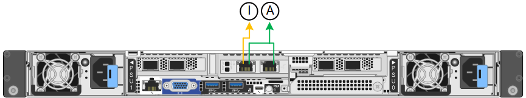

= Modos de enlace de puertos (SGF6112)
:allow-uri-read: 
:icons: font
:imagesdir: ../media/

[role="lead"]
Cuando link:configuring-network-links.html["configurar enlaces de red"] Para el dispositivo SGF6112, puede utilizar la vinculación de puertos para los puertos que se conectan a la red Grid y la red cliente opcional, y los puertos de gestión 1/10-GbE que se conectan a la red de administración opcional. El enlace de puertos ayuda a proteger los datos proporcionando rutas redundantes entre las redes StorageGRID y el dispositivo.

== Modos de enlace de red

Los puertos de red del dispositivo admiten el modo de enlace de puerto fijo o el modo de enlace de puerto agregado para las conexiones Red de grid y Red de cliente.

=== Modo de enlace de puerto fijo

El modo de enlace de puerto fijo es la configuración predeterminada de los puertos de red.

image::../media/sgf6112_fixed_port.png[SGF6112 Modo de enlace de puerto fijo]

[cols="1a,3a"]
|===
| Llamada | Qué puertos están Unidos 

 a| 
C
 a| 
Los puertos 1 y 3 se unen para la red cliente, si se utiliza esta red.

 a| 
G
 a| 
Los puertos 2 y 4 están Unidos para la red de cuadrícula.

|===
Cuando se utiliza el modo de enlace de puerto fijo, los puertos se pueden enlazar mediante el modo de copia de seguridad activa o el modo de protocolo de control de agregación de enlaces (LACP 802.3ad).

* En el modo activo-backup (predeterminado), solo hay un puerto activo a la vez. Si se produce un error en el puerto activo, su puerto de backup proporciona automáticamente una conexión de conmutación por error. El puerto 4 proporciona una ruta de copia de seguridad para el puerto 2 (red de red de cuadrícula) y el puerto 3 proporciona una ruta de copia de seguridad para el puerto 1 (red de cliente).
* En el modo LACP, cada par de puertos forma un canal lógico entre el dispositivo y la red, lo que permite un mayor rendimiento. Si un puerto falla, el otro continúa proporcionando el canal. El rendimiento se reduce, pero la conectividad no se ve afectada.

NOTE: Si no necesita conexiones redundantes, puede utilizar solo un puerto para cada red. Sin embargo, tenga en cuenta que la alerta *Enlace de dispositivo de almacenamiento inactivo* podría activarse en el Administrador de grid después de instalar StorageGRID, lo que indica que un cable está desconectado. Puede desactivar esta regla de alerta con seguridad.

=== Modo de enlace de puerto agregado

El modo de enlace de puerto de agregado aumenta de manera significativa el rendimiento de cada red StorageGRID y proporciona rutas de conmutación al respaldo adicionales.

image::../media/sgf6112_aggregate_ports.png[SGF6100 modos de unión de puertos agregados]

[cols="1a,3a"]
|===
| Llamada | Qué puertos están Unidos 

 a| 
1
 a| 
Todos los puertos conectados se agrupan en un único enlace LACP, lo que permite que todos los puertos se usen para el tráfico de red de grid y de red de cliente.

|===
Si tiene pensado utilizar el modo de enlace de puerto agregado:

* Debe usar el modo de enlace de red LACP.
* Debe especificar una etiqueta de VLAN exclusiva para cada red. Esta etiqueta VLAN se añadirá a cada paquete de red para garantizar que el tráfico de red se dirija a la red correcta.
* Los puertos deben estar conectados a switches que sean compatibles con VLAN y LACP. Si varios switches participan en el enlace LACP, los switches deben ser compatibles con los grupos de agregación de enlaces de varios chasis (MLAG), o equivalentes.
* Comprenderá cómo configurar los switches para usar VLAN, LACP, y MLAG, o equivalente.

Si no desea utilizar los cuatro puertos, puede usar uno, dos o tres puertos. El uso de más de un puerto maximiza la posibilidad de que cierta conectividad de red permanezca disponible si se produce un error en uno de ellos.

NOTE: Si decide utilizar menos de cuatro puertos de red, tenga en cuenta que puede activarse una alerta * de enlace de dispositivo de servicios* en Grid Manager después de instalar el nodo del dispositivo, lo que indica que se ha desconectado un cable. Puede deshabilitar con seguridad esta regla de alerta para la alerta activada.

== Modos de enlace de red para los puertos de gestión

En el caso de los dos puertos de gestión de 1/10 GbE, puede seleccionar el modo de vínculo de red independiente o el modo de vínculo de red Active-Backup para conectarse a la red de administración opcional.

En modo independiente, solo el puerto de gestión de la izquierda está conectado a la red del administrador. Este modo no proporciona una ruta de acceso redundante. El puerto de gestión de la derecha está desconectado y disponible para las conexiones locales temporales (utiliza la dirección IP 169.254.0.1).

En el modo Active-Backup, ambos puertos de gestión están conectados a la red Admin. Solo hay un puerto activo a la vez. Si se produce un error en el puerto activo, su puerto de backup proporciona automáticamente una conexión de conmutación por error. La vinculación de estos dos puertos físicos en un puerto de gestión lógica proporciona una ruta redundante a la red de administración.

NOTE: Si necesita establecer una conexión local temporal con el dispositivo cuando los puertos de gestión 1/10 GbE están configurados para el modo de copia de seguridad activa, quite los cables de ambos puertos de administración, conecte el cable temporal en el puerto de administración de la derecha y acceda al dispositivo con la dirección IP 169.254.0.1.

[cols="1a,3a"]
|===
| Llamada | Modo de enlace de red 

 a| 
A.
 a| 
Modo de copia de seguridad activa. Ambos puertos de gestión están Unidos en un puerto de gestión lógico conectado a la red administrativa.

 a| 
YO
 a| 
Modo independiente. El puerto de la izquierda está conectado a la red de administración. El puerto de la derecha está disponible para conexiones locales temporales (dirección IP 169.254.0.1).

|===