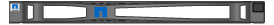

= Desempaquetar cajas
:allow-uri-read: 
:icons: font
:imagesdir: ../media/

[role="lead"]
Antes de instalar el aparato StorageGRID, desembale todas las cajas y compare el contenido con los elementos de la hoja de embalaje.

== Dispositivos SGF6112

=== Hardware subyacente

[cols="1a,4a"]
|===
| Elemento | Cómo se ven 

 a| 
SGF6112
 a| 
image::../media/sg6000_cn_front_without_bezel.gif[Unidades frontales dispositivo SGF6112]

 a| 
Kit de rieles con instrucciones
 a| 
image::../media/rail_kit.gif[Kit de rieles]

 a| 
Cubierta frontal
 a| 

|===

=== Cables de alimentación

El envío de un dispositivo SGF6112 incluye los siguientes cables de alimentación.

TIP: Es posible que el armario tenga cables de alimentación especiales que utilice en lugar de los cables de alimentación que se suministran con el aparato.

[cols="1a,4a"]
|===
| Elemento | Cómo se ven 

 a| 
Dos cables de alimentación para su país
 a| 
image::../media/power_cords.gif[Cables de alimentación]

|===

== Dispositivos SG6000

=== Hardware de SG6060

[cols="1a,4a"]
|===
| Elemento | Cómo se ven 

 a| 
Controlador SG6000-CN
 a| 
image::../media/sg6000_cn_front_without_bezel.gif[Controlador SG6000-CN]

 a| 
Bandeja de controladoras E2860 sin unidades instaladas
 a| 
image::../media/de460c_table_size.gif[Dispositivo SG5760 4U]

 a| 
Dos biseles frontales
 a| 
image::../media/sg6000_front_bezels_for_table.gif[Bezeles delanteros]

 a| 
Kits de dos guías con instrucciones
 a| 
image::../media/rail_kit.gif[Kit de rieles]

 a| 
60 unidades (SSD de 2 TB y NL-SAS de 58 TB)
 a| 
image::../media/sg5760_drive.gif[Unidad]

 a| 
Cuatro asas
 a| 
image::../media/handles.gif[SG5760 gestiona]

 a| 
Soportes traseros y tuercas de jaula para la instalación del bastidor con orificios cuadrados
 a| 
image::../media/back_brackets_table_size.gif[Soportes y tuercas de jaula para SG5760]

|===

=== Estante de expansión SG6060

[cols="1a,4a"]
|===
| Elemento | Cómo se ven 

 a| 
Bandeja de expansión sin unidades instaladas
 a| 
image::../media/de460c_table_size.gif[Dispositivo SG5760 4U]

 a| 
Cubierta frontal
 a| 
image::../media/front_bezel_for_table_de460c.gif[Frontal Bezel DE460C]

 a| 
60 unidades NL-SAS
 a| 
image::../media/sg5760_drive.gif[Unidad]

 a| 
Un kit de guías con instrucciones
 a| 
image::../media/rail_kit.gif[Kit de rieles]

 a| 
Cuatro asas
 a| 
image::../media/handles.gif[SG5760 gestiona]

 a| 
Soportes traseros y tuercas de jaula para la instalación del bastidor con orificios cuadrados
 a| 
image::../media/back_brackets_table_size.gif[Soportes y tuercas de jaula para SG5760]

|===

=== Hardware de SGF6024

[cols="1a,4a"]
|===
| Elemento | Cómo se ven 

 a| 
Controlador SG6000-CN
 a| 
image::../media/sg6000_cn_front_without_bezel.gif[Controlador SG6000-CN]

 a| 
Cabina flash EF570 con 24 unidades de estado sólido (flash) instaladas
 a| 
image::../media/de224c_with_drives.gif[Bandeja de controladoras EF570]

 a| 
Dos biseles frontales
 a| 
image::../media/sgf6024_front_bezels_for_table.png[Molduras frontales SG6024]

 a| 
Kits de dos guías con instrucciones
 a| 
image::../media/rail_kit.gif[Kit de rieles]

 a| 
Tapas de extremo de estante
 a| 
image::../media/endcaps.png[Tapas]

|===

=== Cables y conectores

El envío de un aparato SG6000 incluye los siguientes cables y conectores.

TIP: Es posible que el armario tenga cables de alimentación especiales que utilice en lugar de los cables de alimentación que se suministran con el aparato.

[cols="1a,4a"]
|===
| Elemento | Cómo se ven 

 a| 
Cuatro cables de alimentación para su país
 a| 
image::../media/power_cords.gif[Cables de alimentación]

 a| 
Cables ópticos y transceptores SFP
 a| 
image::../media/fc_cable_and_sfp.gif[Cables ópticos y SFP]

* Cuatro cables ópticos para los puertos de interconexión FC
* Cuatro transceptores SFP+, que admiten FC de 16 GB/s.

 a| 
Opcional: Dos cables SAS para conectar cada bandeja de expansión SG6060
 a| 
image::../media/sas_cable.gif[Cables SAS]

|===

== Dispositivos SG5700

=== Hardware subyacente

[cols="1a,4a"]
|===
| Elemento | Cómo se ven 

 a| 
Dispositivo SG5712 con 12 unidades instaladas
 a| 
image::../media/de212c_table_size.gif[Dispositivo SG5712 2U]

 a| 
Dispositivo SG5760 sin unidades instaladas
 a| 
image::../media/de460c_table_size.gif[Dispositivo SG5760 4U]

 a| 
Panel frontal para el dispositivo
 a| 
image::../media/sg5700_front_bezels.gif[Carretes de SG5712 y SG5760]

 a| 
Kit de rieles con instrucciones
 a| 
image::../media/rail_kit.gif[Kit de rieles]

 a| 
SG5760: Sesenta unidades
 a| 
image::../media/sg5760_drive.gif[Unidad]

 a| 
SG5760: Mangos
 a| 
image::../media/handles.gif[SG5760 gestiona]

 a| 
SG5760: Soportes traseros y tuercas de jaula para la instalación en rack con orificios cuadrados
 a| 
image::../media/back_brackets_table_size.gif[Soportes y tuercas de jaula para SG5760]

|===

=== Cables y conectores

El envío de un aparato SG5700 incluye los siguientes cables y conectores.

TIP: Es posible que el armario tenga cables de alimentación especiales que utilice en lugar de los cables de alimentación que se suministran con el aparato.

[cols="1a,4a"]
|===
| Elemento | Cómo se ven 

 a| 
Dos cables de alimentación para su país
 a| 
image::../media/power_cords.gif[Cables de alimentación]

 a| 
Cables ópticos y transceptores SFP
 a| 
image::../media/fc_cable_and_sfp.gif[Cables ópticos y SFP]

* Dos cables ópticos para los puertos de interconexión de FC
* Ocho transceptores SFP+, compatible con los cuatro puertos FC interconnect de 16 GB/s y los cuatro puertos de red de 10 GbE

|===

== Dispositivos SG100 y SG1000

=== Hardware subyacente

[cols="1a,4a"]
|===
| Elemento | Cómo se ven 

 a| 
SG100 o SG1000
 a| 
image::../media/sg6000_cn_front_without_bezel.gif[Unidades frontales SG 100 o dispositivo de servicios SG1000]

 a| 
Kit de rieles con instrucciones
 a| 
image::../media/rail_kit.gif[Kit de rieles]

|===

=== Cables de alimentación

El envío de dispositivos SG100 o SG1000 incluye los siguientes cables de alimentación.

TIP: Es posible que el armario tenga cables de alimentación especiales que utilice en lugar de los cables de alimentación que se suministran con el aparato.

[cols="1a,4a"]
|===
| Elemento | Cómo se ven 

 a| 
Dos cables de alimentación para su país
 a| 
image::../media/power_cords.gif[Cables de alimentación]

|===