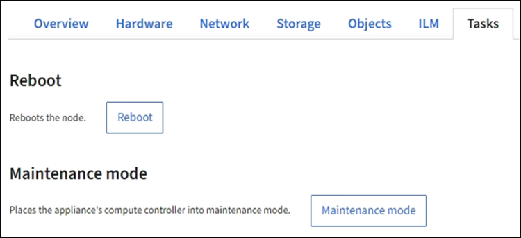

= Coloque el dispositivo en modo de mantenimiento
:allow-uri-read: 
:icons: font
:imagesdir: ../media/

[role="lead"]
Debe colocar el aparato en modo de mantenimiento antes de realizar procedimientos de mantenimiento específicos.

.Antes de empezar
* Ha iniciado sesión en Grid Manager mediante un link:../admin/web-browser-requirements.html["navegador web compatible"].
* Tiene el permiso de mantenimiento o acceso raíz. Para obtener más detalles, consulte las instrucciones para administrar StorageGRID.

.Acerca de esta tarea
En raras ocasiones, una vez que se coloca un dispositivo StorageGRID en modo de mantenimiento puede hacer que el dispositivo no esté disponible para el acceso remoto.

NOTE: La contraseña de la cuenta de administrador y las claves de host SSH para un dispositivo StorageGRID en modo de mantenimiento siguen siendo las mismas que en el momento en que el dispositivo estaba en servicio.

.Pasos
. En Grid Manager, seleccione *NODES*.
. En la vista de árbol de la página Nodes, seleccione Appliance Storage Node.
. Seleccione *tareas*.
+

. Seleccione *modo de mantenimiento*. Se muestra un cuadro de diálogo de confirmación.
. Introduzca la contraseña de aprovisionamiento y seleccione *Aceptar*.
+
Una barra de progreso y una serie de mensajes, incluidos "solicitud enviada", "detención de StorageGRID" y "reinicio", indican que el dispositivo está llevando a cabo los pasos necesarios para entrar en el modo de mantenimiento.

+
Cuando el dispositivo se encuentra en modo de mantenimiento, un mensaje de confirmación enumera las URL que puede utilizar para acceder al instalador de dispositivos de StorageGRID.

+
image::../media/maintenance_mode_urls.png[Direcciones URL del modo de mantenimiento]

. Para acceder al instalador de dispositivos de StorageGRID, busque cualquiera de las direcciones URL que se muestren.
+
Si es posible, utilice la dirección URL que contiene la dirección IP del puerto de red de administración del dispositivo.

+

NOTE: Acceso `+https://169.254.0.1:8443+` requiere una conexión directa con el puerto de gestión local.

. En el instalador de dispositivos StorageGRID, confirme que el dispositivo está en modo de mantenimiento.
+
image::../media/maintenance_mode_notification_bar.png[mensaje del modo de mantenimiento]

. Realice las tareas de mantenimiento necesarias.
. Después de completar las tareas de mantenimiento, salga del modo de mantenimiento y reanude el funcionamiento normal del nodo. En el instalador del dispositivo StorageGRID, seleccione *Avanzado* > *Reiniciar controlador* y, a continuación, seleccione *Reiniciar en StorageGRID*.
+
image::../media/reboot_controller_from_maintenance_mode.png[Reinicie la controladora en modo de mantenimiento]

+
El dispositivo puede tardar hasta 20 minutos en reiniciarse y volver a unirse a la cuadrícula. Para confirmar que el reinicio ha finalizado y que el nodo ha vuelto a unirse a la cuadrícula, vuelva a Grid Manager. La página *nodes* debe mostrar un estado normal (icono de marca de verificación verde image:../media/icon_alert_green_checkmark.png["marca de verificación verde"] a la izquierda del nombre del nodo) del nodo del dispositivo, lo que indica que no hay ninguna alerta activa y que el nodo está conectado a la cuadrícula.

+
image::../media/nodes_menu.png[El nodo del dispositivo se ha vuelto a unir a la cuadrícula]

