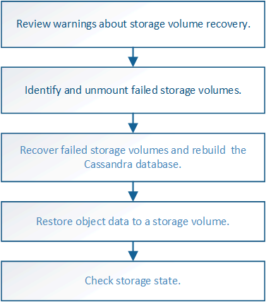

= Recupere de un fallo del volumen de almacenamiento donde la unidad del sistema está intacta: Flujo de trabajo
:allow-uri-read: 
:icons: font
:imagesdir: ../media/

[role="lead"]
Debe completar una serie de tareas para recuperar un nodo de almacenamiento basado en software en el que uno o varios volúmenes de almacenamiento del nodo de almacenamiento han fallado, pero la unidad del sistema está intacta. Si solo los volúmenes de almacenamiento fallan, el nodo de almacenamiento sigue disponible para el sistema StorageGRID.

NOTE: Este procedimiento de recuperación se aplica únicamente a los nodos de almacenamiento basados en software. Si los volúmenes de almacenamiento tienen errores en un nodo de almacenamiento del dispositivo, use el procedimiento del dispositivo: link:recovering-storagegrid-appliance-storage-node.html["Recupere el nodo de almacenamiento del dispositivo"].

Como se muestra en el diagrama de flujo de trabajo, se deben identificar y desmontar los volúmenes de almacenamiento con errores, recuperar los volúmenes, recompilar la base de datos Cassandra y restaurar los datos de objetos.

