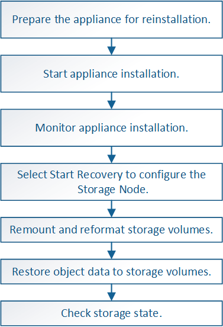

= Recuperar nodo de almacenamiento del dispositivo: Flujo de trabajo
:allow-uri-read: 
:icons: font
:imagesdir: ../media/

[role="lead"]
El procedimiento para recuperar un nodo de almacenamiento en dispositivos StorageGRID con fallos es el mismo tanto si se está recuperando de la pérdida de la unidad del sistema como de la pérdida de volúmenes de almacenamiento únicamente.

Como se muestra en el diagrama de flujo de trabajo, debe preparar el dispositivo y volver a instalar el software, configurar el nodo para volver a unirse al grid, volver a formatear el almacenamiento y restaurar los datos de objetos.

== Precauciones y notas sobre la recuperación de nodos de almacenamiento del dispositivo

CAUTION: Si más de un nodo de almacenamiento presenta errores (o está sin conexión), póngase en contacto con el soporte técnico. No realice el siguiente procedimiento de recuperación. Podrían perderse datos.

CAUTION: Si este es el segundo fallo del nodo de almacenamiento en menos de 15 días después de un fallo o una recuperación en el nodo de almacenamiento, póngase en contacto con el soporte técnico. La reconstrucción de Cassandra en dos o más nodos de almacenamiento en 15 días puede provocar la pérdida de datos.

NOTE: Si se produce un error en más de un nodo de almacenamiento de un sitio, es posible que se requiera un procedimiento de recuperación del sitio. Consulte link:how-site-recovery-is-performed-by-technical-support.html["Cómo realiza la recuperación del sitio el soporte técnico"].

CAUTION: Si las reglas de ILM se configuran para almacenar una sola copia replicada y existe una en un volumen de almacenamiento donde se produjo un error, no podrá recuperar el objeto.

NOTE: Si encuentra una alarma Services: Status - Cassandra (SVST) durante la recuperación, consulte link:../maintain/recovering-failed-storage-volumes-and-rebuilding-cassandra-database.html["Recuperar volúmenes de almacenamiento con fallos y reconstruir la base de datos de Cassandra"]. Una vez reconstruida Cassandra, las alarmas se deberían borrar. Si las alarmas no se borran, póngase en contacto con el soporte técnico.

[NOTE]
====
Para obtener procedimientos de mantenimiento del hardware, como instrucciones para reemplazar una controladora o reinstalar SANtricity OS, consulte las instrucciones de mantenimiento para su dispositivo de almacenamiento.

* link:../sg6100/index.html["Dispositivos de almacenamiento SGF6112"]
* link:../sg6000/index.html["Dispositivos de almacenamiento SG6000"]
* link:../sg5700/index.html["Dispositivos de almacenamiento SG5700"]

====