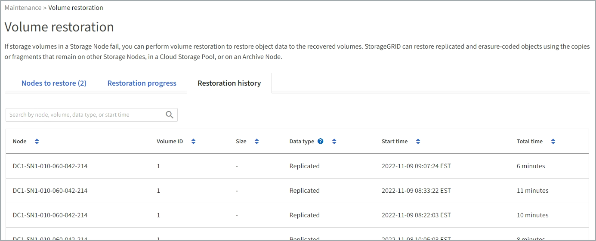

= Restaurar datos de objetos con Grid Manager
:allow-uri-read: 
:icons: font
:imagesdir: ../media/

[role="lead"]
Puede restaurar los datos de objetos para un volumen de almacenamiento con errores o un nodo de almacenamiento mediante Grid Manager. También puede utilizar Grid Manager para supervisar los procesos de restauración en curso y mostrar un historial de restauración.

.Antes de empezar
* Completó cualquiera de estos procedimientos para formatear los volúmenes con errores:
+
** link:../maintain/remounting-and-reformatting-appliance-storage-volumes.html["Volver a montar y volver a formatear los volúmenes de almacenamiento de los dispositivos (pasos manuales)"]
** link:../maintain/remounting-and-reformatting-storage-volumes-manual-steps.html["Volver a montar y volver a formatear los volúmenes de almacenamiento (pasos manuales)"]

* Ha confirmado que el nodo de almacenamiento en el que está restaurando objetos tiene un estado de conexión de *Connected* image:../media/icon_alert_green_checkmark.png["icono de alerta verde marca de verificación"] En la ficha *NODES* > *Descripción general* de Grid Manager.
* Ha confirmado lo siguiente:
+
** No hay una expansión de grid para agregar un nodo de almacenamiento en curso.
** La retirada de nodo de almacenamiento no está en curso o no tiene errores.
** No está en curso la recuperación de un volumen de almacenamiento con fallos.
** No hay una recuperación de un nodo de almacenamiento con una unidad del sistema con fallos en curso.
** No hay un trabajo de nuevo equilibrio de CE en curso.
** La clonación de nodos del dispositivo no está en curso.

.Acerca de esta tarea
Después de reemplazar las unidades y realizar los pasos manuales para formatear los volúmenes, Grid Manager muestra los volúmenes como candidatos para la restauración en la pestaña *MANTENIMIENTO* > *Restauración de volumen* > *Nodos para restaurar*.

Siempre que sea posible, restaure los datos del objeto utilizando la página *Volume restoration* en Grid Manager. Siga estas directrices:

* Si los volúmenes se enumeran en *MANTENIMIENTO* > *Restauración de volumen* > *Nodos a restaurar*, restaure los datos del objeto como se describe en los siguientes pasos. Se enumerará los volúmenes si:
+
** Se produjo un error en algunos volúmenes de almacenamiento de un nodo, pero no en todos
** Todos los volúmenes de almacenamiento de un nodo tienen errores y se reemplazan por la misma cantidad de volúmenes o más volúmenes

+
La página de restauración de volumen en Grid Manager también le permite <<view-restoration-progress,supervise el proceso de restauración de volúmenes>> y.. <<view-restoration-history,ver el historial de restauración>>.

* Si los volúmenes no aparecen en Grid Manager como candidatos para la restauración, siga los pasos que correspondan para usar el `repair-data` script para restaurar datos de objeto:
+
** link:restoring-object-data-to-storage-volume.html["Restauración de datos de objeto en un volumen de almacenamiento (fallo de unidad de sistema)"]
** link:restoring-object-data-to-storage-volume-where-system-drive-is-intact.html["Restaure los datos de objetos al volumen de almacenamiento donde la unidad del sistema esté intacta"]
** link:restoring-object-data-to-storage-volume-for-appliance.html["Restaure datos de objetos al volumen de almacenamiento de dispositivo"]

+
Si el nodo de almacenamiento recuperado contiene menos volúmenes que el nodo en el que sustituye, debe utilizar el `repair-data` guión.

Es posible restaurar dos tipos de datos de objetos:

* Los objetos de datos replicados se restauran desde otras ubicaciones, suponiendo que las reglas de ILM del grid se configuraron para que haya copias de objetos disponibles.
+
** Si se configuró una regla de ILM para almacenar una sola copia replicada y esa copia estaba en un volumen de almacenamiento que falló, no podrá recuperar el objeto.
** Si la única copia restante de un objeto se encuentra en un Cloud Storage Pool, StorageGRID debe emitir varias solicitudes al extremo Cloud Storage Pool para restaurar datos de objetos.
** Si la única copia restante de un objeto se encuentra en un nodo de archivado, los datos de objeto se recuperan del nodo de archivado. Restaurar datos de objetos a un nodo de almacenamiento a partir de un nodo de archivado tarda más que restaurar copias de objetos desde otros nodos de almacenamiento.

* Los objetos de datos codificados de borrado (EC) se restauran reensamblando los fragmentos almacenados. El algoritmo de código de borrado vuelve a crear los fragmentos dañados o perdidos a partir de los datos y fragmentos de paridad restantes.

NOTE: La restauración de volúmenes depende de la disponibilidad de recursos donde se almacenan las copias de objetos. El progreso de la restauración de volúmenes no es lineal y puede tardar días o semanas en completarse.

== Restaure el nodo o el volumen con errores

Siga estos pasos para restaurar un nodo o volumen con errores.

.Pasos
. En Grid Manager, vaya a *MANTENIMIENTO* > *Restauración de volumen*.
. Seleccione la pestaña *Nodos para restaurar*.
+
El número de la pestaña indica la cantidad de nodos con volúmenes que requieren restaurar.

+
image::../media/vol-restore-nodes-to-restore.png[Volume restoration: Pestaña Nodes to restore]

. Expanda cada nodo para ver los volúmenes que necesita restauración y su estado.
. Corrija cualquier problema que impida la restauración de cada volumen que se indica al seleccionar Esperar pasos manuales, si se muestra como el estado del volumen.
. Seleccione un nodo para restaurar donde todos los volúmenes indican el estado Listo para restaurar.
+
Solo es posible restaurar los volúmenes de un nodo a la vez.

+
Cada volumen del nodo debe indicar que está listo para restaurar.

. Seleccione *Iniciar restauración*.
. Aborda cualquier advertencia que pueda aparecer o selecciona *Iniciar de todos modos* para ignorar las advertencias e iniciar la restauración.

Los nodos se mueven de la pestaña *Nodes to restore* a la pestaña *Restoration Progress* cuando comienza la restauración.

Si no se puede iniciar una restauración de volumen, el nodo vuelve a la pestaña *Nodes to restore*.

== [[view-restore-progress]]Ver progreso de restauración

La pestaña *Progreso de la restauración* muestra el estado del proceso de restauración del volumen y la información sobre los volúmenes de un nodo que se está restaurando.

image::../media/vol-restore-restore-progress.png[Restauración de volumen: Pestaña Progreso de restauración]

Las tasas de reparación de datos para objetos replicados y con código de borrado en todos los volúmenes son medias que resumen todas las restauraciones en curso, incluidas las restauraciones iniciadas mediante el `repair-data` guión. También se indica el porcentaje de objetos en esos volúmenes que están intactos y no requieren restauración.

NOTE: La restauración de datos replicada depende de la disponibilidad de los recursos donde se almacenan las copias replicadas. El progreso de la restauración de datos replicados no es lineal y puede tardar días o semanas en completarse.

La sección Trabajos de restauración muestra información sobre restauraciones de volúmenes iniciadas desde Grid Manager.

* El número del encabezado de la sección Trabajos de restauración indica el número de volúmenes que se restauran o se ponen en cola para la restauración.
* En la tabla se muestra información sobre cada volumen del nodo que se está restaurando y su progreso.
+
** El progreso de cada nodo muestra el porcentaje de cada trabajo.
** Expanda la columna Detalles para mostrar la hora de inicio de la restauración y el ID del trabajo.

* Si falla la restauración de un volumen:
+
** La columna Estado indica Error.
** Aparece un error que indica la causa del fallo.
+
Corrija los problemas indicados en el error. A continuación, seleccione *Reintentar* para reiniciar la restauración del volumen.

+
Si varios trabajos de restauración han fallado, al seleccionar *Reintentar* se inicia el trabajo fallido más reciente.

== [[view-restore-history]]Ver historial de restauración

La pestaña *Historial de restauración* muestra información sobre todas las restauraciones de volumen que se han completado con éxito.

NOTE: Los tamaños no son aplicables a los objetos replicados y no se muestran solo para las restauraciones que contienen objetos de datos con código de borrado (EC).

