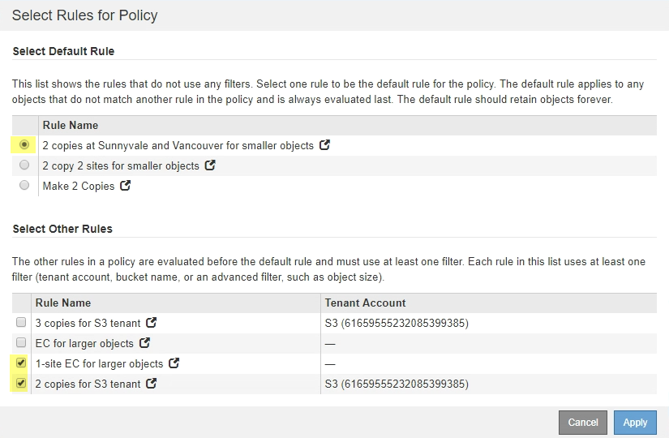

= Paso 3: Revisar la política de ILM
:allow-uri-read: 
:icons: font
:imagesdir: ../media/

[role="lead"]
En el paso 3 (revisar la política ILM) del asistente de sitio de retirada, puede determinar si la política de ILM activa hace referencia al sitio.

.Antes de empezar
Comprende bien cómo funciona ILM y está familiarizado con la creación de pools de almacenamiento, perfiles de codificación de borrado, reglas de ILM, y la simulación y activación de una política de ILM. Consulte link:../ilm/index.html["Gestión de objetos con ILM"].

.Acerca de esta tarea
StorageGRID no puede retirar un sitio si se hace referencia a ese sitio mediante alguna regla de gestión del ciclo de vida de la información activa.

Si su política actual de ILM hace referencia al sitio que desea quitar, debe activar una nueva política de ILM que cumpla con ciertos requisitos. En concreto, la nueva política de ILM:

* No se puede utilizar un grupo de almacenamiento que haga referencia al sitio o utilice la opción Todos los sitios.
* No se puede utilizar un perfil de código de borrado que haga referencia al sitio.
* No se puede utilizar la regla de creación de copias 2 de StorageGRID 11,6 o de instalaciones anteriores.
* Debe estar diseñado para proteger completamente todos los datos de objetos.
+

IMPORTANT: No cree nunca una regla de ILM de una sola copia para acomodar la eliminación de un sitio. Una regla de ILM que crea solo una copia replicada en cualquier periodo de tiempo pone los datos en riesgo de pérdida permanente. Si sólo existe una copia replicada de un objeto, éste se pierde si falla un nodo de almacenamiento o tiene un error importante. También perderá temporalmente el acceso al objeto durante procedimientos de mantenimiento, como las actualizaciones.

Si está realizando un _sitio conectado Decomisión_, debe considerar cómo StorageGRID debe administrar los datos del objeto actualmente en el sitio que desea eliminar. En función de los requisitos de protección de datos, las nuevas reglas pueden mover los datos de objetos existentes a diferentes sitios o pueden eliminar las copias de objetos adicionales que ya no sean necesarias.

Póngase en contacto con el soporte técnico si necesita ayuda para diseñar la nueva política.

.Pasos
. En el paso 3 (revisar la política de ILM), determinar si alguna regla de ILM de la política activa de ILM se refiere al sitio que seleccionó para quitar.
. Si no hay reglas en la lista, seleccione *Siguiente* para ir a. link:step-4-remove-ilm-references.html["Paso 4: Eliminar referencias de ILM"].
. Si una o más reglas de ILM aparecen en la tabla, seleccione el vínculo situado junto a *Nombre de directiva activa*.
+
La página de políticas de ILM se muestra en una nueva pestaña del explorador. Utilice esta pestaña para actualizar ILM. La página Sitio de retirada permanecerá abierta en la pestaña otros.

+
.. Si es necesario, selecciona *ILM* > *Pools de almacenamiento* para crear uno o más pools de almacenamiento que no hagan referencia al sitio.
+

NOTE: Para obtener más detalles, consulte las instrucciones para gestionar objetos con gestión del ciclo de vida de la información.

.. Si planea usar código de borrado, seleccione *ILM* > *código de borrado* para crear uno o más perfiles de codificación de borrado.
+
Debe seleccionar pools de almacenamiento que no hagan referencia al sitio.

+

NOTE: No utilice el grupo de almacenamiento *Todos los nodos de almacenamiento* (StorageGRID 11,6 y anteriores) en los perfiles de codificación de borrado.

. Seleccione *ILM* > *Rules* y clone cada una de las reglas enumeradas en la tabla para el Paso 3 (Revisar política de ILM).
+

NOTE: Para obtener más detalles, consulte las instrucciones para gestionar objetos con gestión del ciclo de vida de la información.

+
.. Utilice nombres que facilitan la selección de estas reglas en una directiva nueva.
.. Actualice las instrucciones de colocación.
+
Quite los pools de almacenamiento o los perfiles de codificación de borrado que hagan referencia al sitio y sustitúyalos por nuevos pools de almacenamiento o perfiles de codificación de borrado.

+

NOTE: No use el grupo de almacenamiento *Todos los nodos de almacenamiento* en las nuevas reglas.

. Seleccione *ILM* > *Policies* y cree una nueva política que utilice las nuevas reglas.
+

NOTE: Para obtener más detalles, consulte las instrucciones para gestionar objetos con gestión del ciclo de vida de la información.

+
.. Seleccione la directiva activa y seleccione *Clonar*.
.. Escriba un nombre de política y un motivo para el cambio.
.. Seleccione reglas para la política clonada.
+
*** Borre todas las reglas enumeradas para el paso 3 (revisar política de ILM) de la página Sitio de retirada.
*** Seleccione una regla predeterminada que no haga referencia al sitio.
+

NOTE: No seleccione la regla *Hacer 2 copias* porque esa regla usa el grupo de almacenamiento *Todos los nodos de almacenamiento*, que no está permitido.

*** Seleccione las demás reglas de reemplazo que ha creado. Estas reglas no deben referirse al sitio.
+

.. Seleccione *aplicar*.
.. Arrastre las filas para reordenar las reglas de la política.
+
No puede mover la regla predeterminada.

+

IMPORTANT: Debe confirmar que las reglas de ILM se encuentran en el orden correcto. Cuando se activa la directiva, las reglas del orden indicado evalúan los objetos nuevos y existentes, empezando por la parte superior.

.. Guarde la directiva propuesta.

. Procese objetos de prueba y simule la política propuesta para garantizar que se aplican las reglas correctas.
+

CAUTION: Los errores de un política de ILM pueden provocar la pérdida de datos irrecuperable. Revise y simule cuidadosamente la directiva antes de activarla para confirmar que funcionará según lo previsto.

+

CAUTION: Cuando se activa una nueva política de ILM, StorageGRID la utiliza para gestionar todos los objetos, incluidos los existentes y los objetos recién procesados. Antes de activar una nueva política de ILM, revise los cambios que se produzcan en la ubicación de los objetos replicados y los códigos de borrado existentes. El cambio de la ubicación de un objeto existente podría dar lugar a problemas temporales de recursos cuando se evalúan e implementan las nuevas colocaciones.

. Activar la nueva política.
+
Si va a realizar una retirada de sitios conectados, StorageGRID empieza a eliminar datos de objetos del sitio seleccionado en cuanto activa la nueva política de gestión del ciclo de vida de la información. Mover o eliminar todas las copias de objetos puede llevar semanas. Aunque puede iniciar con seguridad un decomiso de sitio mientras los datos del objeto siguen estando en el sitio, el procedimiento de retirada se completará más rápidamente y con menos interrupciones e impactos en el rendimiento si permite que los datos se muevan desde el sitio antes de iniciar el procedimiento de retirada real (Seleccionando *Iniciar misión* en el paso 5 del asistente).

. Vuelva a *Paso 3 (revisar la política de ILM)* para asegurarse de que no haya reglas de ILM en la nueva política activa. Consulte el sitio y el botón *Siguiente* esté activado.
+
image::../media/decommission_site_step_3_no_rules.png[Retirada del emplazamiento Paso 3 sin reglas]

+

NOTE: Si aparece alguna regla en la lista, debe crear y activar una nueva política de ILM para poder continuar.

. Si no aparece ninguna regla, seleccione *Siguiente*.
+
Aparece el paso 4 (Eliminar referencias de ILM).

