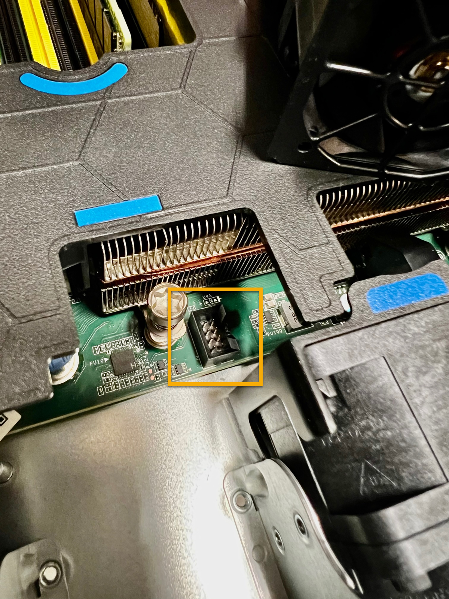

= Sustituya el ventilador de un dispositivo SGF6112
:allow-uri-read: 
:icons: font
:imagesdir: ../media/

[role="lead"]
El dispositivo SGF6112 tiene ocho ventiladores de refrigeración. Si uno de los ventiladores falla, debe reemplazarla por Lo antes posible. para que el dispositivo tenga la refrigeración adecuada.

.Antes de empezar
* Tiene el ventilador de sustitución correcto.
* Ha determinado la ubicación del ventilador que se va a sustituir.
+
link:verify-component-to-replace.html["Verifique el componente que desea reemplazar"]

* Ha localizado físicamente el dispositivo SGF6112 en el que va a sustituir el ventilador en el centro de datos.
+
link:locating-sgf6112-in-data-center.html["Localice el dispositivo en el centro de datos"]

+

NOTE: A. link:shut-down-sgf6112.html["apagado controlado del aparato"] es necesario antes de retirar el dispositivo del rack.

* Ha desconectado todos los cables y retirado la cubierta del aparato.
+
link:reinstalling-sgf6112-cover.html["Retire la cubierta SGF6112"]

* Ha confirmado que los otros ventiladores están instalados y en ejecución.

.Acerca de esta tarea
Para evitar interrupciones del servicio, confirme que el resto de los nodos de almacenamiento están conectados al grid antes de comenzar a sustituir el ventilador o sustituir el ventilador durante una ventana de mantenimiento programada si se esperan períodos de interrupción del servicio. Consulte la información acerca de link:../monitor/monitoring-system-health.html#monitor-node-connection-states["supervisar los estados de conexión de los nodos"].

IMPORTANT: Si alguna vez ha utilizado una regla de ILM que crea solo una copia de un objeto, debe sustituir el ventilador durante una ventana de mantenimiento programada. De lo contrario, es posible que pierda temporalmente el acceso a esos objetos durante este procedimiento. Consulte la información acerca de link:../ilm/why-you-should-not-use-single-copy-replication.html["por qué no debe utilizar replicación de copia única"].

No se podrá acceder al nodo del dispositivo mientras sustituye el ventilador.

La fotografía muestra un ventilador del aparato. Se resalta el conector eléctrico. Se puede acceder a los ventiladores de refrigeración después de retirar la cubierta superior del aparato.

NOTE: Cada una de las dos unidades de suministro de alimentación también contiene un ventilador. Los ventiladores de suministro de alimentación no se incluyen en este procedimiento.

image::../media/sgf6112_fan_fru.png[FRU del ventilador SGF6112]

.Pasos
. Envuelva el extremo de la correa de la muñequera ESD alrededor de su muñeca y fije el extremo de la pinza a una masa metálica para evitar descargas estáticas.
. Localice el ventilador que debe reemplazar.
+
Los ocho ventiladores se encuentran en las siguientes posiciones del chasis (mitad delantera de SGF6112 con la cubierta superior quitada):

+
image::../media/SGF6112-fan-locations.png[Ubicaciones de los ventiladores]

|===

|  | Unidad de ventilador 

 a| 
1
 a| 
Ventilador_SYS0

 a| 
2
 a| 
Ventilador_SYS1

 a| 
3
 a| 
Ventilador_SYS2

 a| 
4
 a| 
Ventilador_SYS3

 a| 
5
 a| 
Ventilador_SYS4

 a| 
6
 a| 
Ventilador_SYS5

 a| 
7
 a| 
Ventilador_SYS6

 a| 
8
 a| 
Ventilador_SYS7

|===
. Utilice las pestañas azules del ventilador para extraer el ventilador que ha fallado del chasis.
+
image::../media/fan_removal.png[Extracción del ventilador]

. Deslice el ventilador de repuesto en la ranura abierta del chasis.
+
Asegúrese de alinear el conector del ventilador con la toma de la placa de circuitos.

. Presione firmemente el conector del ventilador en la placa de circuitos (toma resaltada).
+

. Vuelva a colocar la cubierta superior en el aparato y presione el pestillo hacia abajo para fijar la cubierta en su lugar.
. Encienda el dispositivo y supervise los LED del dispositivo y los códigos de inicio.
+
Utilice la interfaz de BMC para supervisar el estado de inicio.

. Confirme que el nodo del dispositivo aparece en Grid Manager y que no aparece ninguna alerta.

Tras sustituir la pieza, devuelva la pieza que ha fallado a NetApp, tal y como se describe en las instrucciones de RMA incluidas con el kit. Consulte https://mysupport.netapp.com/site/info/rma["Retorno de artículo  sustituciones"^] para obtener más información.
