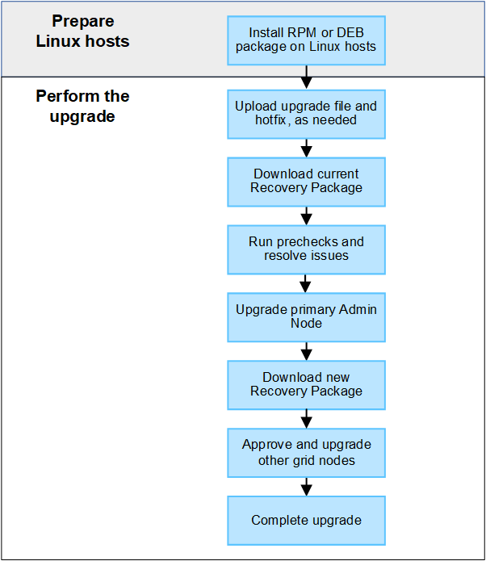

= Actualizar el flujo de trabajo
:allow-uri-read: 
:icons: font
:imagesdir: ../media/

[role="lead"]
Antes de iniciar la actualización, revise el flujo de trabajo general. La página de actualización de StorageGRID le guiará en cada paso de actualización.

. Si se pone en marcha algún nodo StorageGRID en hosts Linux, link:linux-installing-rpm-or-deb-package-on-all-hosts.html["Instale el paquete RPM o DEB en cada host"] antes de iniciar la actualización.
. Desde el nodo de administración principal, acceda a la página Actualización de StorageGRID y cargue el archivo de actualización y el archivo de revisión, si es necesario.
. Descargue el paquete de recuperación actual.
. Ejecute comprobaciones previas de actualización para detectar y resolver cualquier problema antes de iniciar la actualización real.
. Inicie la actualización, que ejecuta comprobaciones previas y actualiza automáticamente el nodo de administrador principal. No puede acceder a Grid Manager mientras se está actualizando el nodo de administración principal. Además, los registros de auditoría no estarán disponibles. Esta actualización puede llevar hasta 30 minutos.
. Después de actualizar el nodo de administración principal, descargue un nuevo paquete de recuperación.
. Apruebe los nodos de la cuadrícula. Puede aprobar nodos de cuadrícula individuales, grupos de nodos de cuadrícula o todos los nodos de cuadrícula.
+

IMPORTANT: No apruebe la actualización para un nodo de grid a menos que esté seguro de que el nodo está listo para detenerse y reiniciarse.

. Reanude las operaciones. Una vez que se han actualizado todos los nodos de grid, se habilitan las nuevas funciones para que se puedan reanudar las operaciones. Debe esperar para realizar un procedimiento de retirada o expansión hasta que la tarea en segundo plano *Upgrade database* y la tarea *Final upgrade steps* se hayan completado.

.Información relacionada
link:estimating-time-to-complete-upgrade.html["Estime el tiempo para completar una actualización"]
